# Auto-Dev

Automated development loop that orchestrates multiple Claude Code sessions to handle the full feature development workflow—from issue selection to production deployment.

## Overview

`./code.sh` fetches GitHub issues, plans implementations, writes code, runs tests, reviews changes, and deploys—all with minimal human intervention.

```bash
./code.sh                      # Run continuous loop (triage → select → dev)
./code.sh --once               # Run single cycle including triage
./code.sh -i 42                # Work on specific issue (implies --once)
./code.sh --issue 42           # Same as above
./code.sh --resume             # Resume in-progress work only
./code.sh --status             # Show triage and dev status
./code.sh --triage             # Triage-only mode, then exit
./code.sh --hint "..."         # Provide priority hint for issue selection
./code.sh --init               # Initial setup (GitHub labels) - run once per repo
```

### Selection Hints

Guide issue prioritization with natural language:

```bash
./code.sh --hint "Work on issue #42 first, then #46, then #58"
./code.sh --hint "Focus on countdown timer bugs before other issues"
./code.sh --hint "Prioritize issues #42, #46, #58, #97 in that order"
```

## Features

- **User Feedback Triage** — Automatically breaks down `user-feedback` labeled issues into atomic dev tasks
- **GitHub-based Memory** — All state stored in labels and comments
- **Crash Recovery** — Resume from any phase after interruption
- **Multi-machine Support** — Start on laptop, continue on desktop
- **Cost Tracking** — Accumulated costs tracked per issue
- **Audit Trail** — Every session documented as structured comments
- **Issue Discovery** — Automatically creates issues for bugs/tech debt found during work
- **Pause/Resume** — Press ESC during execution to pause, any key to resume

## Session Architecture

The workflow separates work into distinct Claude Code sessions with intentional context boundaries:

```mermaid
flowchart TD
    subgraph TRIAGE["🔍 SESSION 0: User Feedback Triage"]
        T0[/"Loop ALL 'user-feedback' issues"/]
        T1["Analyze scope, create atomic issues"]
        T2["Close parent or convert to Epic"]
        T0 --> T1 --> T2
    end

    subgraph SELECT["📋 SESSION 1: Issue Selection"]
        S1["Fetch open GitHub issues"]
        S2["Skip 'user-feedback' issues"]
        S3["Pick best atomic issue"]
    end

    subgraph PLAN["📝 SESSION 2: Planning"]
        P1["Explore codebase"]
        P2["Create implementation plan"]
        P3["Post plan as issue comment"]
    end

    subgraph IMPLEMENT["⚡ SESSION 3: Implementation"]
        I1["Implement feature"]
        I2["Run lint, build, tests"]
        I3["Manual testing via Playwright"]
        I4["Create PR"]
    end

    subgraph CI["⏳ CI WAIT"]
        C1["Poll gh pr checks"]
        C2["30s intervals, 15min max"]
    end

    subgraph REVIEW["👁️ SESSION 4: Code Review"]
        R1["Fresh eyes review"]
        R2["Security & correctness checks"]
        R3{"Approved?"}
    end

    subgraph FIX["🔧 SESSION 5: Fix Feedback"]
        F1["Address review comments"]
        F2["Push fixes"]
    end

    subgraph DOCS["📚 SESSION 7: Documentation"]
        D1["Update CLAUDE.md if needed"]
        D2["Wait for CI if changed"]
    end

    subgraph DEPLOY["🚀 SESSION 6: Merge & Deploy"]
        M1["Squash merge PR"]
        M2["Wait for Railway deploy"]
        M3["Verify in production"]
    end

    COMPLETE((✅ Complete))

    TRIAGE -->|"--triage flag"| EXIT((Exit))
    TRIAGE -->|"All triaged"| SELECT
    SELECT --> PLAN
    PLAN --> IMPLEMENT
    IMPLEMENT --> CI
    CI --> REVIEW
    R3 -->|"Changes"| FIX
    FIX --> CI
    R3 -->|"Approved"| DOCS
    DOCS --> DEPLOY
    DEPLOY --> COMPLETE

    style TRIAGE fill:#e1f5fe,stroke:#01579b
    style SELECT fill:#e1f5fe,stroke:#01579b
    style PLAN fill:#e1f5fe,stroke:#01579b
    style REVIEW fill:#e1f5fe,stroke:#01579b
    style FIX fill:#e1f5fe,stroke:#01579b
    style DOCS fill:#e1f5fe,stroke:#01579b
    style IMPLEMENT fill:#fff3e0,stroke:#e65100
    style DEPLOY fill:#fff3e0,stroke:#e65100
    style CI fill:#f5f5f5,stroke:#616161
    style COMPLETE fill:#c8e6c9,stroke:#2e7d32
    style EXIT fill:#ffcdd2,stroke:#c62828
```



**Context Types:**
- 🔵 **Clean Context** (blue): Fresh session, no prior bias — critical for objective review
- 🟠 **Shared Context** (orange): Maintains state for tight feedback loops
- ⬜ **No Claude** (gray): Script-only operations

### Session Details

| Session | Context | Labels | Purpose |
|---------|---------|--------|---------|
| **0: Triage** | Clean | `triage:pending` → `analyzing` → `complete` | Break down user feedback into atomic issues |
| **1: Selection** | Clean | `selecting` | Pick highest-priority actionable issue |
| **2: Planning** | Clean | `planning` | Explore codebase, create implementation plan |
| **3: Implementation** | Shared | `implementing` → `pr-waiting` | Code, test, create PR |
| **4: Review** | Clean | `reviewing` + `round:<n>` | Objective code review without implementation bias |
| **5: Fix** | Clean | `fixing` | Address review feedback |
| **6: Deploy** | Shared | `merging` → `verifying` → `complete` | Merge, deploy, verify in production |
| **7: Docs** | Clean | — | Update CLAUDE.md on feature branch |

## GitHub Memory System

All workflow state is stored in GitHub, enabling crash recovery and multi-machine support.

### Triage Labels

User feedback issues are processed through triage before development:

| Label | Description |
|-------|-------------|
| `auto-dev:triage:pending` | Feedback awaiting triage |
| `auto-dev:triage:analyzing` | Being analyzed for scope |
| `auto-dev:triage:complete` | Triage complete, child issues created |
| `auto-dev:triage:blocked` | Triage needs manual intervention |

### Phase Labels

Issues are tagged with exactly one phase label at any time:

| Label | Description |
|-------|-------------|
| `auto-dev:selecting` | Being analyzed for selection |
| `auto-dev:planning` | Creating implementation plan |
| `auto-dev:implementing` | Writing code and testing |
| `auto-dev:pr-waiting` | PR created, waiting for CI |
| `auto-dev:reviewing` | Under code review |
| `auto-dev:fixing` | Addressing review feedback |
| `auto-dev:merging` | Being merged and deployed |
| `auto-dev:verifying` | Production verification |
| `auto-dev:complete` | Successfully completed |
| `auto-dev:blocked` | Needs manual intervention |
| `auto-dev:ci-failed` | CI checks failing |

### Metadata Labels

| Pattern | Example | Description |
|---------|---------|-------------|
| `auto-dev:branch:<name>` | `auto-dev:branch:feat/issue-47` | Branch name |
| `auto-dev:round:<n>` | `auto-dev:round:2` | Current review round |
| `auto-dev:cost:<amount>` | `auto-dev:cost:1.23` | Total accumulated cost |

> **Note:** PR associations are tracked via GitHub's native linked PR feature (using "Closes #issue" in PR descriptions) rather than labels.

### Signal Labels

Signal labels are used by Claude sessions to communicate completion status. They are consumed (removed) after being read by the script.

| Label | Description |
|-------|-------------|
| `auto-dev:signal:review-approved` | Review passed, ready to proceed |
| `auto-dev:signal:review-changes` | Review requests changes |
| `auto-dev:signal:needs-update` | Documentation needs updating |

### Session Comments

Each session posts a structured comment to the issue:

```markdown
## 🤖 Auto-Dev Session: Implementation

| Field | Value |
|-------|-------|
| **Session ID** | `session-1736692800-12345` |
| **Started** | 2026-01-12T14:00:00Z |
| **Completed** | 2026-01-12T14:08:30Z |
| **Duration** | 8m 30s |
| **Cost** | $0.25 |

### Summary
Implemented feature and created PR #47 on branch `feat/issue-47`.

### Details
**PR:** #47
**Branch:** `feat/issue-47`
```

### Implementation Plans

Plans are stored as issue comments with markers for reliable parsing:

```markdown
<!-- AUTODEV-PLAN-START -->
## Implementation Plan for Issue #42

### Summary
...

### Files to Modify
...

### Implementation Steps
...

### Testing Plan
...
<!-- AUTODEV-PLAN-END -->
```

## Resume & Recovery

### Automatic Resume

The script automatically detects and resumes in-progress work:

```bash
./code.sh
# Output:
# Found in-progress issue #42 in phase: reviewing
# Resuming issue #42 from phase: reviewing
```

### Manual Resume

Resume only in-progress work (don't start new issues):

```bash
./code.sh --resume
```

### Check Status

```bash
./code.sh --status
# Output:
# ISSUE  PHASE           TITLE
# -----  -----           -----
# #42    reviewing       Add dark mode toggle
#        └─ PR #47, Cost: $0.48
# #43    implementing    Fix login bug
```

### Recovering Blocked Issues

When an issue is blocked:

1. The `auto-dev:blocked` label is added
2. A comment explains the reason
3. The script moves to the next issue

To resume:

1. Fix the underlying problem
2. Remove the `auto-dev:blocked` label
3. Add the appropriate phase label (e.g., `auto-dev:implementing`)
4. Run `./code.sh --resume`

## Why Session Boundaries Matter

### Shared Context Sessions

Sessions 3 and 6 use **shared context** because they involve tight feedback loops:
- Implementation → Testing → Fixing requires remembering what was just written
- PR creation needs context of all changes made
- Merge → Deploy → Verify are sequential dependent steps

### Clean Context Sessions

Sessions 1, 2, 4, 5, and 7 use **clean context** for objectivity:
- **Issue Selection**: Focused decision-making without baggage
- **Planning**: Fresh codebase exploration without selection bias
- **Code Review**: No "I know what I meant" bias—reviews actual code objectively
- **Fix Feedback**: Address specific comments without defensive context
- **Documentation**: Runs on feature branch before merge, changes go through CI

### The Code Review Insight

Session 4 (Code Review) is **intentionally separate** with a clean context. This is the key quality mechanism:

- Claude reviews the PR as if seeing it for the first time
- No confirmation bias from implementing the code
- Catches issues the implementer was blind to
- Simulates having a real colleague review your PR

## Configuration

| Setting | Value | Description |
|---------|-------|-------------|
| `MAX_REVIEW_ROUNDS` | 10 | Max review/fix cycles before blocking |
| CI poll interval | 30 sec | Time between CI status checks |
| CI max wait | 15 min | Maximum time to wait for CI |
| No issues wait | 30 min | Sleep duration when no issues available |
| Between cycles | 30 sec | Pause between development cycles |
| Resume pause | 5 sec | Brief pause between resume iterations |

## Error Handling

| Failure | Behavior |
|---------|----------|
| No issues found | Wait 30 minutes, retry |
| Implementation fails | Mark blocked, continue to next |
| CI fails | Mark blocked (`auto-dev:ci-failed`) |
| CI timeout | Mark blocked after 15 minutes |
| Review not approved after 10 rounds | Mark blocked |
| Deployment fails | Mark blocked |
| Script crashes | Resumes automatically from last phase |
| Network errors (CI check) | Retry up to 5 times |

## Prerequisites

- [`claude`](https://github.com/anthropics/claude-code) CLI installed and authenticated
- [`gh`](https://cli.github.com/) CLI installed and authenticated
- [`jq`](https://jqlang.github.io/jq/) installed
- [`railway`](https://docs.railway.app/reference/cli-api) CLI (for deployment verification)
- Playwright MCP configured (for browser testing)

## Initial Setup

Run once per repository to create the required GitHub labels:

```bash
./code.sh --init
```

## Claude Configuration

The script runs Claude with:

```bash
--dangerously-skip-permissions  # Bypasses permission prompts for full automation
--model opus                    # Uses Claude Opus for highest quality reasoning
--output-format stream-json     # Enables progress streaming
--verbose                       # Detailed logging
-p                              # Print mode (non-interactive)
```

> **Warning**: Ensure you trust the codebase before running unattended.

## Local State

The script maintains local state in `.auto-dev/` (gitignored):

```
.auto-dev/
├── auto-dev.log           # Full execution log with raw JSON
```

GitHub stores the authoritative state via labels and comments. Local files are for debugging only.

## Cleanup

The script automatically cleans up on exit:
- Kills background processes (dev servers)
- Stops processes on port 3000
- Terminates node processes for the project

## Customization

Edit `./code.sh` to modify:

- **Issue selection criteria** — Edit `select_issue()` prompt
- **Review strictness** — Edit `review_code()` checklist
- **Wait times** — Modify `sleep` values
- **Max review rounds** — Change `MAX_REVIEW_ROUNDS`
- **Add custom phases** — Create new functions and update `resume_from_phase()`
- **Signal labels** — Add new signals in `SIGNAL_LABELS` array

## Portable Usage

The script operates on the current working directory, so you can run it from any project:

```bash
cd /path/to/project && /path/to/code.sh
```

## License

MIT
